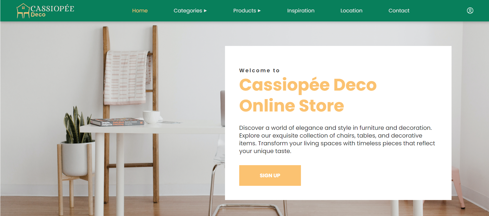
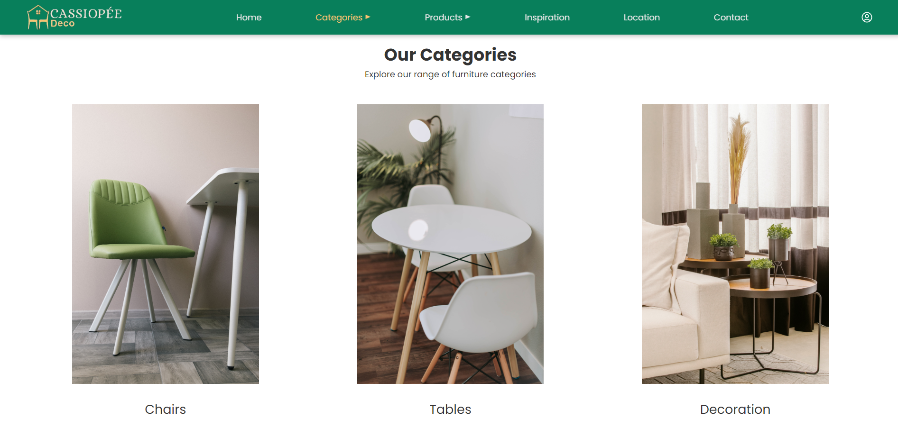
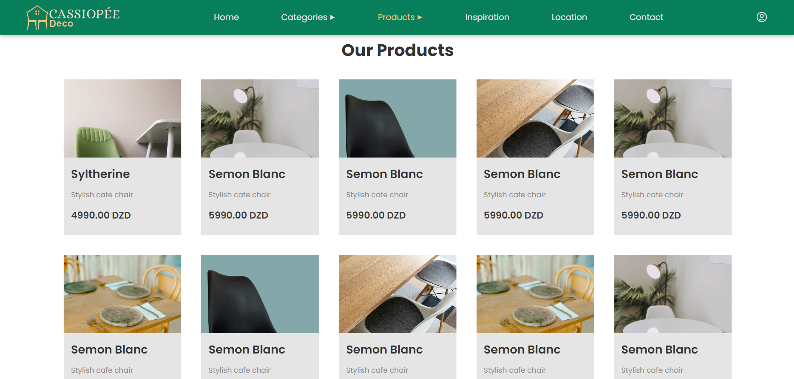
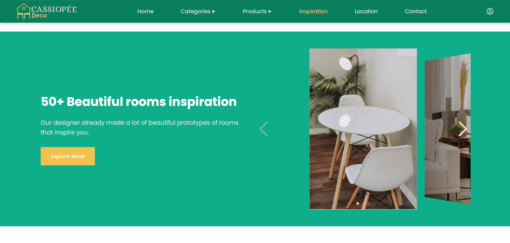
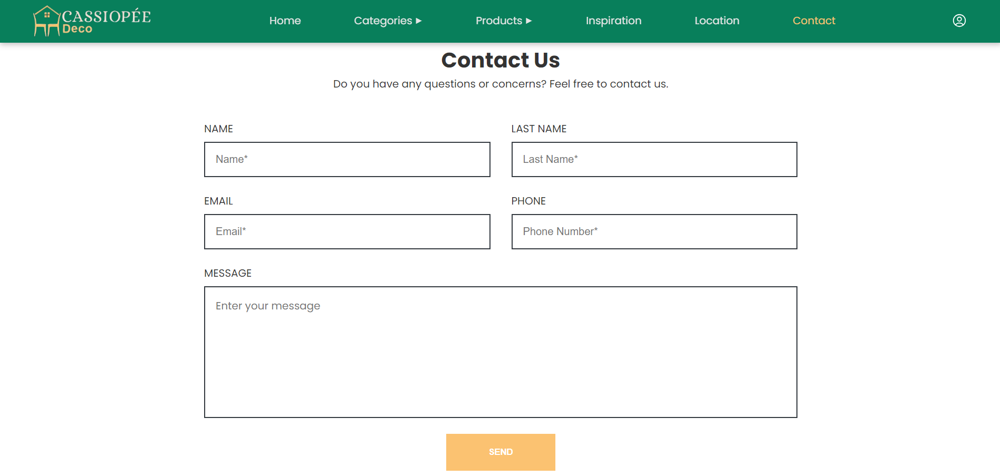
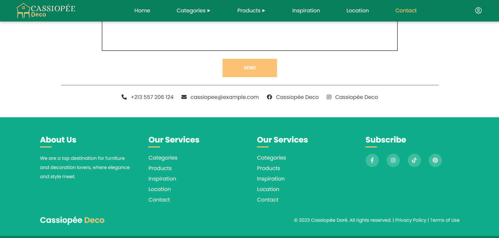
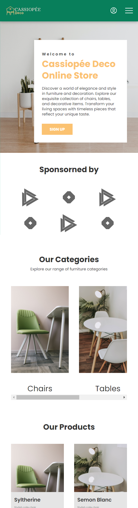

# Cassiopée Deco - Landing Page

This repository contains the code for **Cassioppée Deco**, a beautifully designed landing page for a furniture and decor store. The website features a clean and modern aesthetic, showcasing various furniture categories, products, and an inspiration section. This project was developed doing TASK01 as a part of an internship at **Prodigy Infortech**.

## Features

- **Responsive Design**: Fully responsive and optimized for desktop and mobile devices.
- **Category Pages**: Browse different categories like chairs, tables, and decor items.
- **Product Showcase**: Display detailed information about products.
- **Location Integration**: Map embedded for store location with easy navigation.
- **Contact Form**: Integrated form for customer inquiries.
- **Inspiration Section**: Design ideas with interactive image sliders.

## Technologies Used

- **HTML5**: Structure of the landing page.
- **CSS3**: Styling and responsive design.
- **JavaScript**: Interactive elements and sliders.
- **ReactJs**: For creating reusable components and managing application state
- **Google Maps API**: For displaying the store’s location.
- **FontAwesome**: For icons and imagery.

## Screenshots

### Home Page


### Categories Page


### Product Section


### Inspiration Section


### Contact Form


### Footer 


### Mobile Version 



## Installation

1. Clone this repository:

   ```bash
   git clone https://github.com/moncefchelm18/PRODIGY_WD_01

2. Navigate to the project directory:

   ```bash
   cd landing-page-cassiopee-deco

3. Open the index.html file in your browser or set up a local server (e.g., using Live Server on VSCode).

## Demo
Check out the live version of this landing page .

## Contact

If you have any questions or feedback, feel free to reach out via:

- **Email**: mounsif.chelgham@univ-constantine2.dz
- **Phone**: +213 562189015
- **LinkedIn**: [LinkedIn Profile](https://www.linkedin.com/in/your-linkedin-profile/)


